## Hi, I'm David Dada 👋

Smart contract engineer — I build on-chain systems in **Solidity**, **Rust**, and **Cairo**.

- 🔭 **Working on:** modular contract architecture (EIP-2535 Diamonds) and account abstraction (EIP-4337 / EIP-7702)
- 🦄 **Into:** Uniswap v4 hooks, Arbitrum Stylus, and zero-knowledge (SP1, Starknet)
- 🧩 **Open source:** [`diamond-lib`](https://github.com/dadadave80/diamond-lib), [`lattice`](https://github.com/dadadave80/lattice), [`ticket`](https://github.com/hostit-events/ticket) — more in my pinned repos above
- 💬 **Ask me about:** Diamonds, smart wallets, or anything that compiles to a chain
- 📫 **Reach me:** [X / @dadadave80](https://x.com/dadadave80)

**Stack:** Solidity · Rust · Cairo · Move · TypeScript · Foundry

